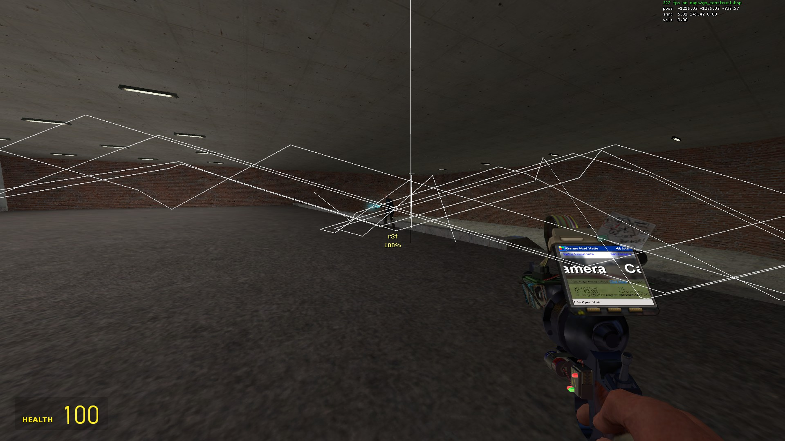

garrysmod_addons
===

Some Lua addons/scripts I wrote for Garry's Mod / GMOD.

These are the files that I didn't make `aaaaaaaaa_wisp_stuff/lua/autorun/server/sv_ttt_radio_sounds.lua` and `aaaaaaaaa_wisp_stuff/lua/mapstuff/sh_ttt_clocktown_v1.lua`.

There might be like 1 other file but I removed ones that weren't by me or the ones listed above.

aaa_pudl_workshop (workshop downloader)
---
This is probably one of my favourite addons I've made.

No more needing to have a simple file with a lot of resource.AddWorkshop() entries, instead download this complicated addon that grabs the addons in a collection first map load, caches it in a text file, and then serves the addons from then on to every user! Easy!

But really, I like this a lot.

Caches an addon list into `data/pudl_connecting_<workshop_collection_id>.txt`

ConVars:
`pudl_workshop_connecting <workshop_collection_id>`
- Downloads when a playing is connecting (Sending client info... etc)
`pudl_workshop_ingame_force <workshop_collection_id>`
- Downloads when a player is ingame (I never implemented this...)
`pudl_workshop_ingame_optional <workshop_collection_id>`
- Brings up a little prompt with the ability for users to open the workshop page for an addon in the steam overlay.

aaaaaaaaa_wisp_stuff - A lot of great stuff
---
- ttt_slender_v2 & crummycradle changes...
- Open a player's profile from the ULX bans page (`lua/ulx/xgui/settings/ulx_xgui_bans_openprofile.lua`)
- `ulx lockserver`, `ulx openmotd`, etc in `lua/ulx/modules/sh/`
- Blocking of `point_clientcommand`, `point_servercommand`, and `point_broadcastclientcommand` (<-- does that one work?) in `lua/entities/`
- Higher jumps / slower falling (`lua/autorun/sh_jumppack_always.lua`)
- ply:PData -> using SID64
- TTT Karma fixes (because we want 1337 instead of 1000)
- TTT scoreboard menus for and colors
- Player chat colors and such
- Join/disconnect messages
- Kill/headshot counter
- Pointshop disguiser port thing
- Pointshop fixes because it randomly disables models sometimes...
- random chat commands (/shrug, !stopsounds, etc)
- Blocking players (cheaters) from seeing who is spectating them.
- Auto demo recording
- C4, Health station, etc outlines
- Round start window flashing (the taskbar icon on windows flashes)
- etc etc etc (there were more but I removed some that I don't want in the repo)

autowants - DarkRP auto wanting system
---
Very basic script I made for someone.

Automatically "wants" a player if they kill other players or lockpick and hit the random dice roll of chance...

tracegun - Seriously, please check this out in Sandbox, it's great!
---
Hard to describe, but something like this is what I've wanted for a long time. It's not what I had imagined but it was a lot lot lot simpler to make it as a gun instead of something that'd follow in a first-person perspective around the course it lays out...

Here's a picture...
Each line is a path from one surface to the next. Shoot a wall at an angle? It reflects off the wall following the opposite angle... just basic stuff but I really love it...

ttt_weapons - TTT weapon scripts
---
- Remove some weapons from spawning (knife, shotguns)
- "Better" crosshair
- M16 aim-down-sight / zoom sensitivity adjustment. (It was too fast previously)
- Health station usage plays a Legend of Zelda Sound

wisp_item_selector
---
An addon I wanted to make to replace the Pointshop being used on my TTT server. I'm not a fan of spending ingame credits to purchase models/hats/trails/etc to use. It's lame. So I was working on this to basically work as a free Pointshop. Never finished of course....

Should check it out ingame...
